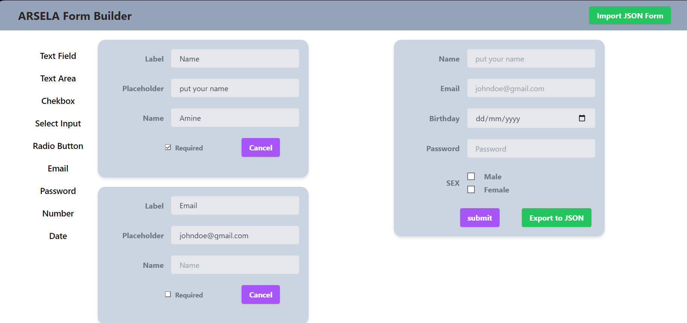
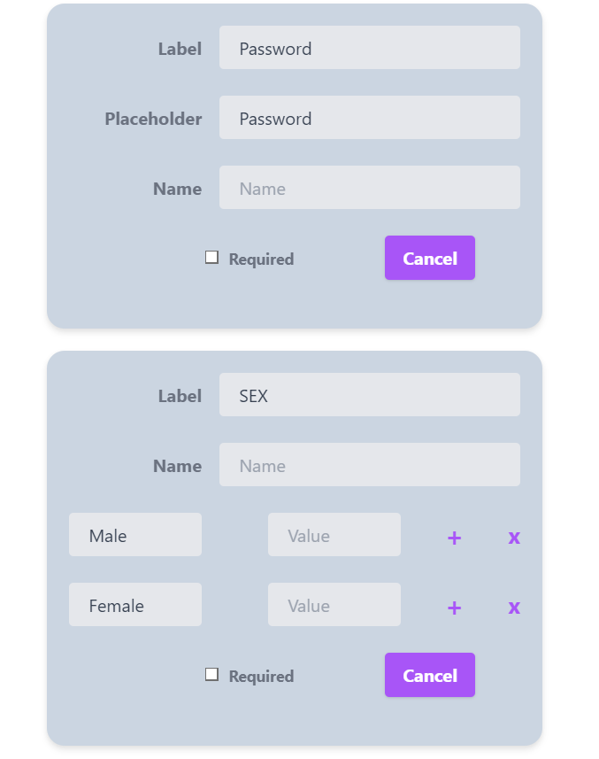
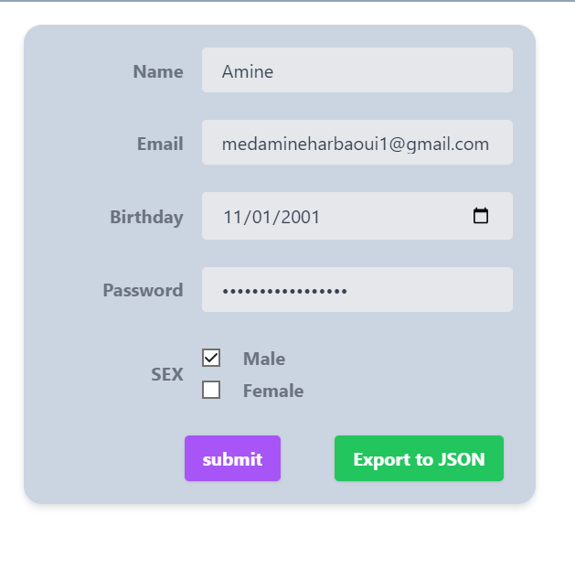
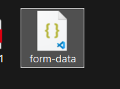
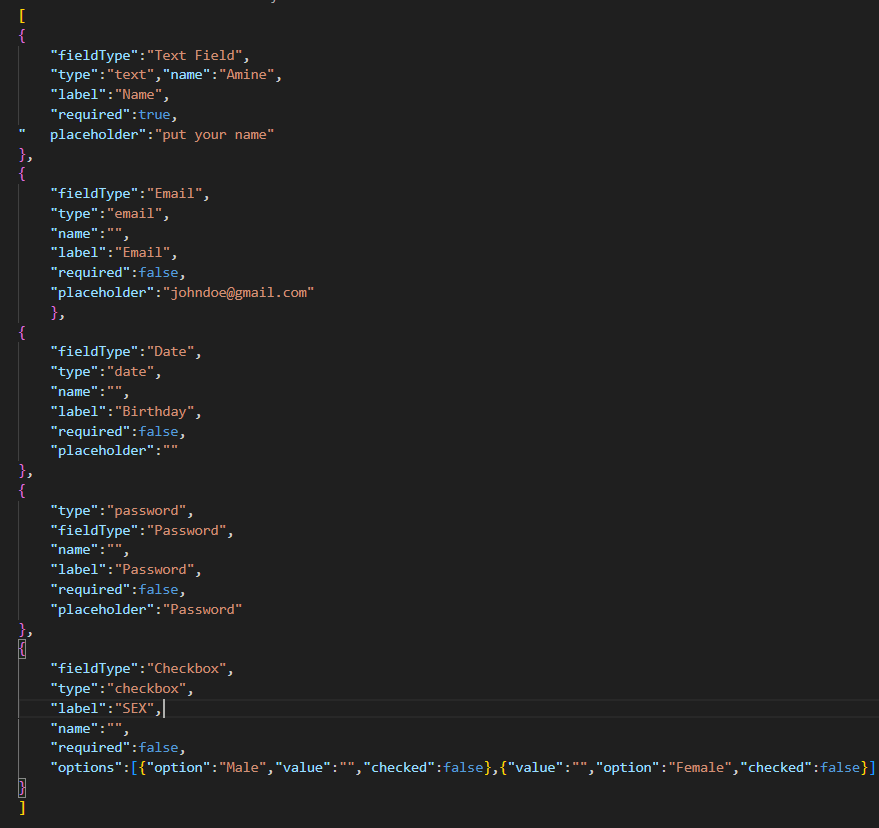

# Form Generator with React JS
 
This project is demonstrates an interactive and user-friendly form generator that allows users to create custom forms with a variety of field types.

# Features

Form Creation Interface:
    - Add various field types (text, number, date, checkbox, radio button, dropdown, etc.).
    - Modify field properties (name, ID, class, default values, etc.).
    - Drag-and-drop to reorder fields.
    - Delete individual fields.

Form Generation:
    - Live preview of the form as it's being built.
    - Generate ready-to-use HTML, CSS, and JavaScript code.
    - Export the form as a JSON file for later use.

Form Importing:
    - Import previously created forms from JSON files.

Responsive Design:
    - Compatible with desktops, tablets, and smartphones.

Evaluation Criteria:
    - Efficient use of React JS (components, states, hooks, etc.).
    - Clean and organized code structure.
    - User-friendly UI/UX design.
    - Cross-browser and device compatibility

# Demo

The left side is responsible for building the form.

Cancel is responsible for deleting a field from the form

We can Drag and drop the fields to reorder them.

The right side is where we can visualize the form that we are building.

Download Exported Form

Exported Form

Better Overview in the Form.pdf .
